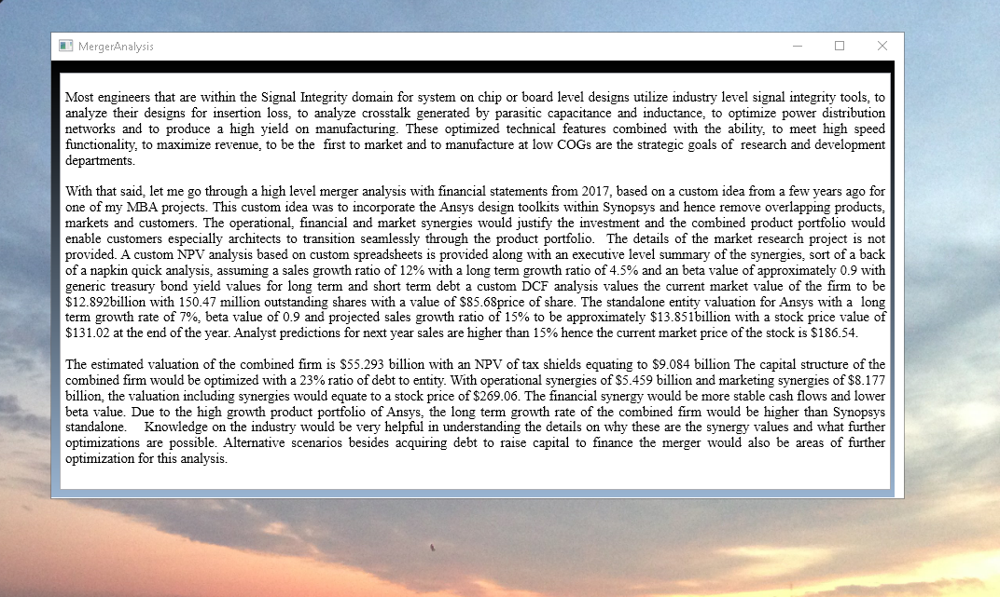
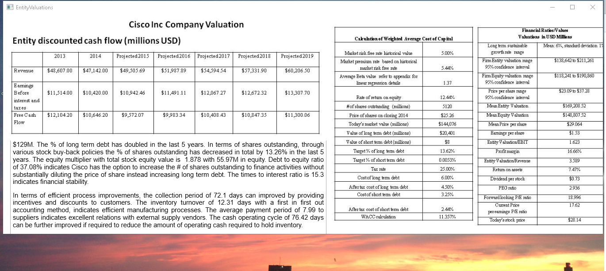
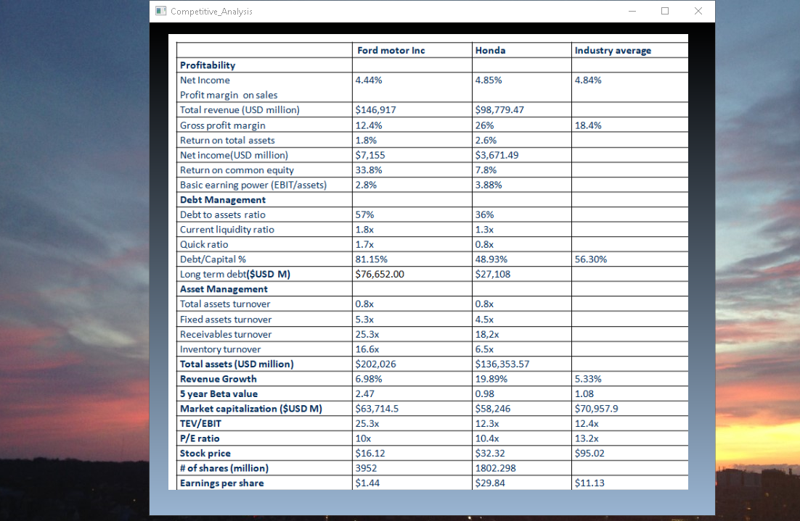
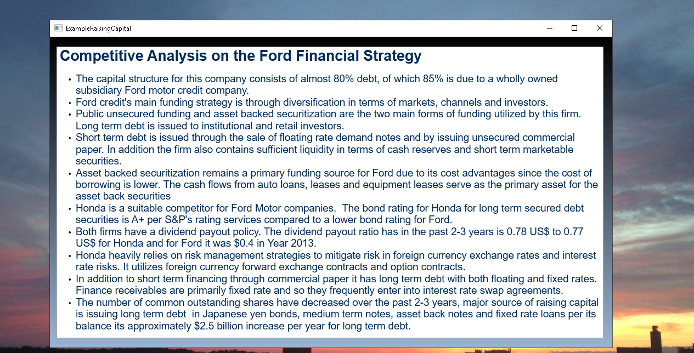
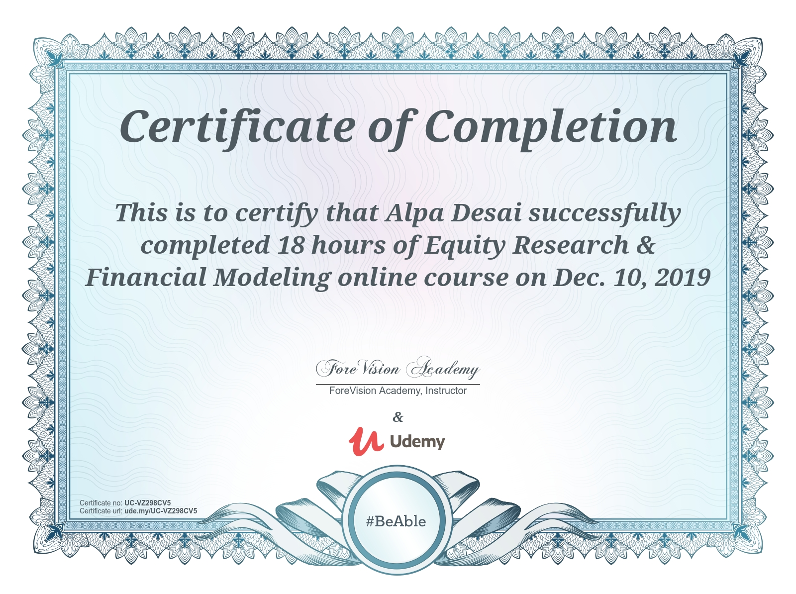
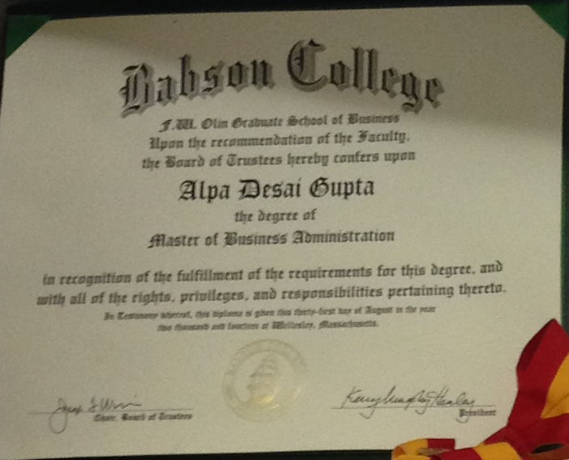

# Financial Markets, Entity Valuations and Business Development

The project provides an introduction to the process of mergers and acquisitions. Confidential information is not displayed. 
Please download the executable in https://github.com/alpaddesai/MergersAcquisitions/releases for details. 
All images are either custom by Alpa D Desai or a reference name is included.
Most of the images are custom. 

## Merger Analysis

## Raising Capital

## Forming a Corporation

## Cisco Custom Entity Valutions

## Competitive Analysis

## Raising Capital Strategy

## Equity Research and Financial Planning

Further M&A projects include :https://github.com/alpaddesai/MergersDocumentIdea , https://github.com/alpaddesai/BusinessDevelopmentIdea , https://github.com/alpaddesai/BusinessLaw, https://github.com/alpaddesai/InnovationandGrowthIdea and https://github.com/alpaddesai/InternationalManagerialFinance

## MBA

## Ethics and Excellence

Focused courses https://github.com/alpaddesai/DataMining,  https://github.com/alpaddesai/ManagementConsulting, https://github.com/alpaddesai/ManagingTechnologicalInnovation, 
https://github.com/alpaddesai/Macroeconomics,  https://github.com/alpaddesai/Entrepreneurship, https://github.com/alpaddesai/Strategy, https://github.com/alpaddesai/FinancialAccountingIdea, https://github.com/alpaddesai/ManagerialAccounting, https://github.com/alpaddesai/SystemLevelDesignProductPortfolioIdea, https://github.com/alpaddesai/PortfolioReturnGUIIdea , https://github.com/alpaddesai/ProductMarketing , https://github.com/alpaddesai/GlobalSupplyChainOperationsManagement and https://github.com/alpaddesai/IndustrialRoboticAutomation.

                   

